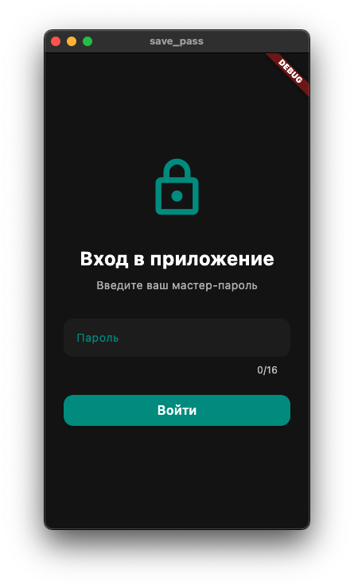
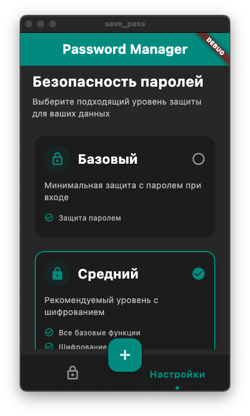
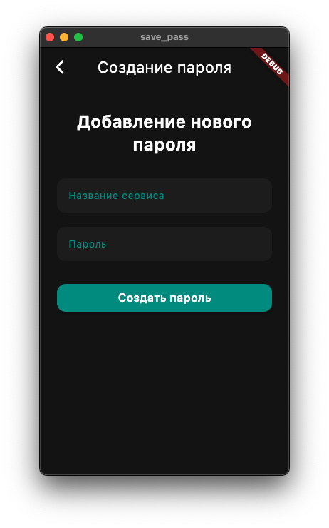

# Менеджер паролей — безопасное хранилище

Этот проект представляет собой безопасное приложение для хранения паролей с многоуровневой системой шифрования. Приложение использует комбинацию криптографических методов для защиты данных на разных уровнях безопасности.

## Основные возможности

### Многоуровневая система безопасности:
- Базовый уровень (без шифрования)
- Средний уровень (одиночное RSA-шифрование)
- Высокий уровень (двойное RSA-шифрование с чередованием ключей)

### Управление ключами:

- Пары RSA-ключей для шифрования/дешифрования
- Дополнительная защита с помощью XOR-шифра
- Хеширование SHA-256 для генерации ключей

### Изолированные криптографические операции:

- Ресурсоемкие операции выполняются в изолятах (isolates) для плавности интерфейса

## Процесс работы

### Первый запуск:

- Пользователь создает мастер-пароль
- Система генерирует и сохраняет зашифрованные RSA-ключи

### Последующие входы:

- Пользователь вводит мастер-пароль
- Получает и устанавливает уровень безопасности
- Система расшифровывает RSA-ключи

## Зависимости
- crypto: Для хеширования SHA-256
- crypton: Для RSA-шифрования/дешифрования
- encrypt_decrypt_plus: Для XOR-шифрования
- smart_encrypt: Для AES-шифрования ключей безопасности

## Скриншоты приложения  

### Окно входа 
 

### Окно паролей 
  

### Настройки безопасности  
  

### Добавление пароля

